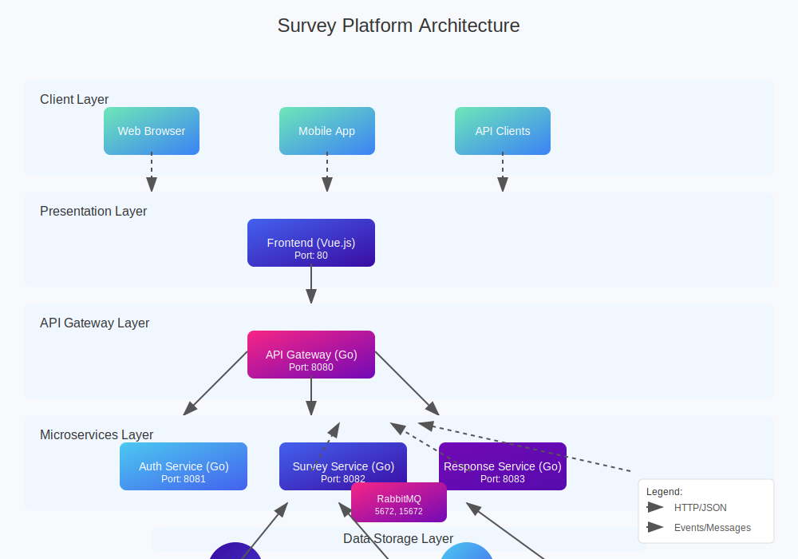
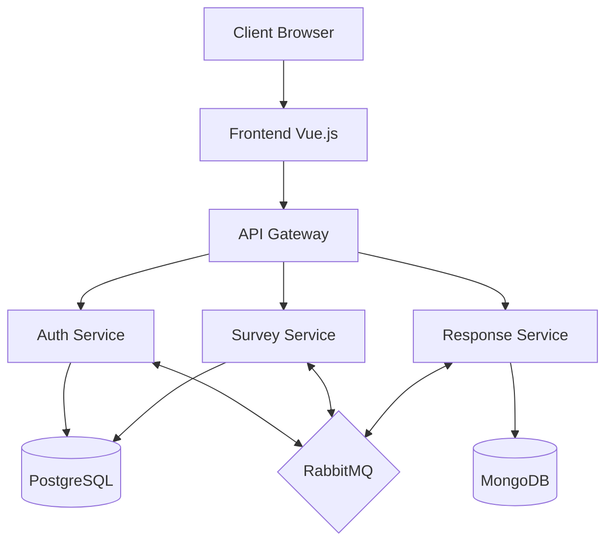
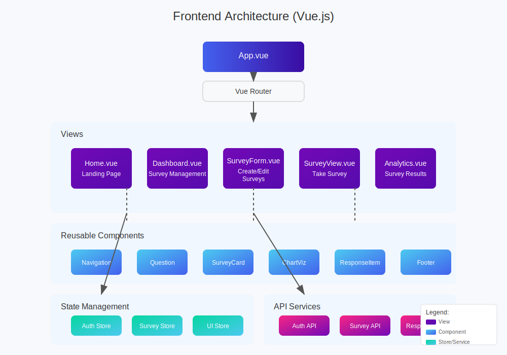

# Survey Platform

<div align="center">
  
  <p>A modern microservices-based survey platform for collecting and analyzing feedback</p>
  
  
  
  
  
</div>

## 📋 Overview

This platform enables organizations to create, distribute, and analyze surveys through an intuitive interface with robust backend services. Built with a microservices architecture, it provides scalability and separation of concerns.

### ✨ Key Features

- 🔐 User authentication and profile management
- 📝 Intuitive survey builder with various question types
- 📊 Real-time analytics and response visualization
- 🔄 Seamless survey distribution and sharing capabilities
- 👥 Role-based access control

## 🏗️ Architecture

The application follows a microservices architecture pattern with the following components:

<div align="center">
  
</div>

<details>
<summary>Alternative mermaid diagram representation</summary>


</details>

### Frontend Structure

The frontend is built with Vue.js and follows the component-based architecture:

<div align="center">
  
</div>

### 🧩 Microservices

- **Frontend** (Vue.js) - Modern responsive UI with Vuetify 3
- **API Gateway** (Go) - Routing, authentication, and request handling
- **Auth Service** (Go) - User management and authentication
- **Survey Service** (Go) - Survey CRUD operations
- **Response Service** (Go) - Response collection and analytics

### 💾 Data Storage

- **PostgreSQL** - Relational data (users, surveys, questions)
- **MongoDB** - Survey responses
- **RabbitMQ** - Asynchronous communication between services

## 🚀 Getting Started

### Prerequisites

- Docker and Docker Compose
- Git

### Installation

1. **Clone the repository**

```bash
git clone https://github.com/yourusername/survey-app.git
cd survey-app
```

2. **Start the application**

```bash
docker-compose up -d
```

3. **Access the services**

- Frontend: http://localhost:80
- API Gateway: http://localhost:8080
- Auth Service: http://localhost:8081
- Survey Service: http://localhost:8082
- Response Service: http://localhost:8083
- RabbitMQ Management: http://localhost:15672 (username: rabbitmq, password: rabbitmq)
- MongoDB Express: http://localhost:8084 (username: mongo, password: mongo)

## 💻 Development

### Project Structure

```
survey-app/
├── frontend/               # Vue.js frontend application
│   ├── src/                # Source code
│   │   ├── assets/         # Static assets
│   │   ├── components/     # Reusable Vue components
│   │   ├── router/         # Vue Router configuration
│   │   ├── services/       # API clients and services
│   │   ├── store/          # Vuex/Pinia state management
│   │   ├── utils/          # Utility functions
│   │   └── views/          # Page components
│   └── Dockerfile          # Frontend container definition
│
├── api-gateway/            # API Gateway service (Go)
│   ├── cmd/                # Application entry points
│   └── internal/           # Private application code
│
├── auth-service/           # Authentication service (Go)
│   ├── cmd/                # Application entry points
│   └── internal/           # Private application code
│
├── survey-service/         # Survey management service (Go)
│   ├── cmd/                # Application entry points
│   └── internal/           # Private application code
│
├── response-service/       # Response handling service (Go)
│   ├── cmd/                # Application entry points
│   └── internal/           # Private application code
│
├── docker/                 # Docker configuration files
│   ├── db/                 # Database initialization
│   └── nginx/              # Nginx configuration
│
└── docker-compose.yml      # Service orchestration
```

### Service Structure (Go Microservices)

Each Go microservice follows a clean architecture pattern:

```
service-name/
├── cmd/
│   └── app/
│       └── main.go        # Entry point
├── internal/
│   ├── config/            # Configuration
│   ├── handlers/          # HTTP handlers
│   ├── models/            # Data models
│   ├── repository/        # Data access
│   └── service/           # Business logic
├── Dockerfile             # Docker build
└── go.mod                 # Go modules
```

## 📝 API Reference

### Auth Service

| Method | Endpoint                 | Description            |
|--------|--------------------------|------------------------|
| POST   | /api/v1/auth/register    | Register a new user    |
| POST   | /api/v1/auth/login       | User login             |
| POST   | /api/v1/auth/refresh     | Refresh JWT token      |
| GET    | /api/v1/users/me         | Get current user       |
| PUT    | /api/v1/users/me         | Update user profile    |

### Survey Service

| Method | Endpoint                       | Description            |
|--------|--------------------------------|------------------------|
| GET    | /api/v1/surveys                | List all surveys       |
| GET    | /api/v1/surveys/:id            | Get survey by ID       |
| POST   | /api/v1/surveys                | Create new survey      |
| PUT    | /api/v1/surveys/:id            | Update survey          |
| PUT    | /api/v1/surveys/:id/status     | Update survey status   |
| DELETE | /api/v1/surveys/:id            | Delete survey          |
| POST   | /api/v1/surveys/:id/questions  | Add question to survey |

### Response Service

| Method | Endpoint                      | Description              |
|--------|-------------------------------|--------------------------|
| POST   | /api/v1/responses             | Submit survey response   |
| GET    | /api/v1/responses/:surveyId   | Get survey responses     |
| GET    | /api/v1/analytics/:surveyId   | Get survey analytics     |

## 🔧 Future Improvements

We have identified several areas for enhancing the platform in the future:

- Mobile application support
- Advanced analytics and reporting
- Integration with third-party services
- Multi-language support
- Advanced question types (file upload, matrices)
- Customizable themes and branding

For a comprehensive roadmap with detailed recommendations, see our [Improvement Plan](docs/IMPROVEMENTS.md).

## 📄 License

This project is licensed under the MIT License - see the LICENSE file for details.

## 👥 Contributors

- [Vitalii Synytskyi](https://github.com/vitaliisynytskyi) 